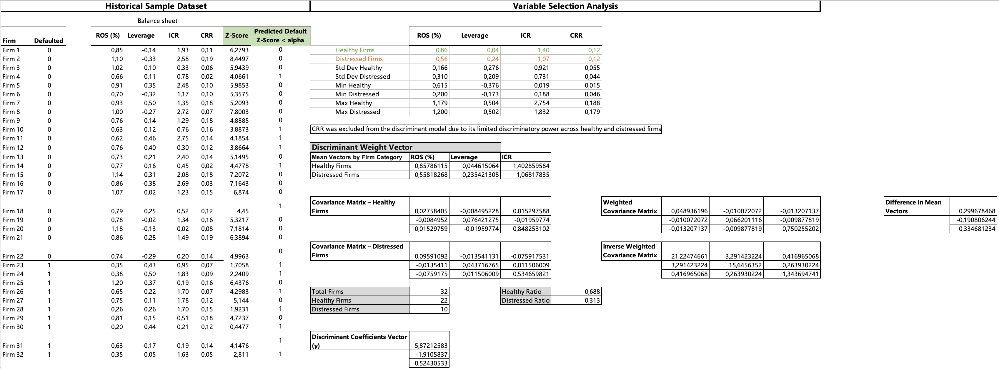
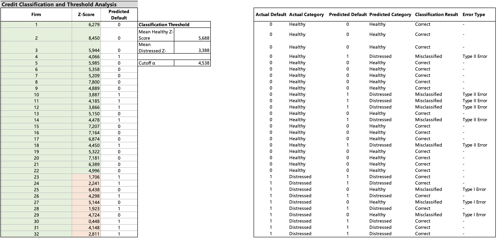
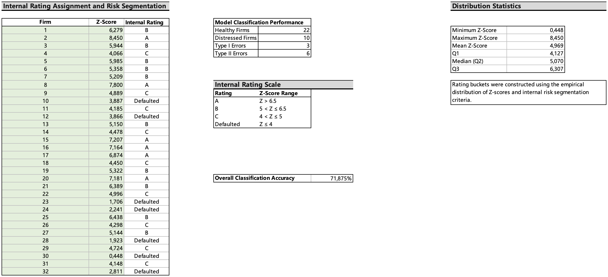

# Credit Risk Assessment and Loan Pricing

Corporate credit risk project combining credit scoring, structural default modeling and market-based spread analysis to evaluate and price a USD 100 million 2-year corporate loan.

---

# Project Overview

This project develops a corporate credit risk framework to assess two corporate borrowers operating in the consumer/service sector and determine which loan application should be approved under credit risk constraints.

The analysis combines three complementary methodologies:

- Linear Discriminant Analysis (LDA) for credit scoring and internal rating assignment
- Merton structural credit risk model for market-implied default probability estimation
- Comparable bond spread analysis for market-based loan pricing

The final recommendation supports the approval of the loan to ABC, which achieved a stronger Z-score, a higher internal rating, and a more favorable overall credit profile than XYZ.

---

# Key Results

| Metric | ABC | XYZ |
|---|---:|---:|
| Z-Score | 12.027 | 4.016 |
| Internal Rating | A | C |
| Loan Decision | Approved | Not Approved |

| Methodology | Key Output |
|---|---|
| Rating-Based Approach | 2-Year PD: 0.11% |
| Merton Model | Risk-Neutral PD: 2.72% |
| Market Comparable Approach | Implied Loan Yield: 4.662% |
| Final Loan Repayment | USD 109.52M |

---

# Credit Scoring and Internal Rating Framework

The credit scoring model was built using Linear Discriminant Analysis (LDA) on three selected financial indicators:

- Return on Sales (ROS)
- Leverage
- Interest Coverage Ratio (ICR)

Customer Retention Rate (CRR) was excluded due to its limited discriminatory power between healthy and distressed firms.



---

# Classification and Rating Assignment

The model classified firms using a discriminant Z-score and a cutoff threshold estimated as the midpoint between healthy and distressed firms.



An internal rating framework was then constructed using the empirical distribution of Z-scores.



---

# Structural Default Estimation

The Merton (1973) structural credit risk model was applied to estimate ABC’s 2-year risk-neutral probability of default.

| Metric | Value |
|---|---:|
| d1 | 2.235 |
| d2 | 1.924 |
| Risk-Neutral PD | 2.72% |

---

# Market-Based Loan Pricing

Since ABC does not have publicly traded bonds, Starbucks Corporation was selected as a comparable issuer based on industry exposure, maturity profile, and investment-grade credit quality.

| Metric | Value |
|---|---:|
| Credit Spread | 0.662% |
| Risk-Free Rate | 4.00% |
| Implied Loan Yield | 4.662% |
| Repayment at Maturity | USD 109.52M |

---

# Methodology Comparison

| Approach | Strengths | Limitations |
|---|---|---|
| Rating-Based Approach | Simple and historically grounded | Backward-looking |
| Merton Model | Forward-looking and theoretically robust | Sensitive to input assumptions |
| Market Comparable Approach | Reflects observable market pricing | Dependent on peer selection and liquidity |

---

# Repository Structure

```text
credit-risk-assessment-and-loan-pricing/
│
├── README.md
│
├── excel-model/
│   ├── credit-risk-analysis-and-loan-pricing.xlsx
│   ├── discriminant_analysis_framework.png
│   ├── credit_classification_and_threshold_analysis.png
│   └── internal_rating_framework.png
│
├── presentation/
│   └── corporate_credit_risk_presentation.pdf
│
└── executive_summary/
    └── executive_summary.pdf

---

Technical and Financial Skills

- Corporate credit risk assessment

- Internal rating system construction

- Linear Discriminant Analysis (LDA)

- Structural default modeling (Merton Model)

- Probability of default (PD) estimation

- Credit spread and bond yield analysis

- Market-based loan pricing

- Financial risk modeling in Excel

- Quantitative credit analysis

- Risk-adjusted lending decisions

---

# Author

**Edoardo Mori**  

Financial Analyst

MSc in Financial Technology and Computing  

For further information: edoardo.mori@usi.ch
